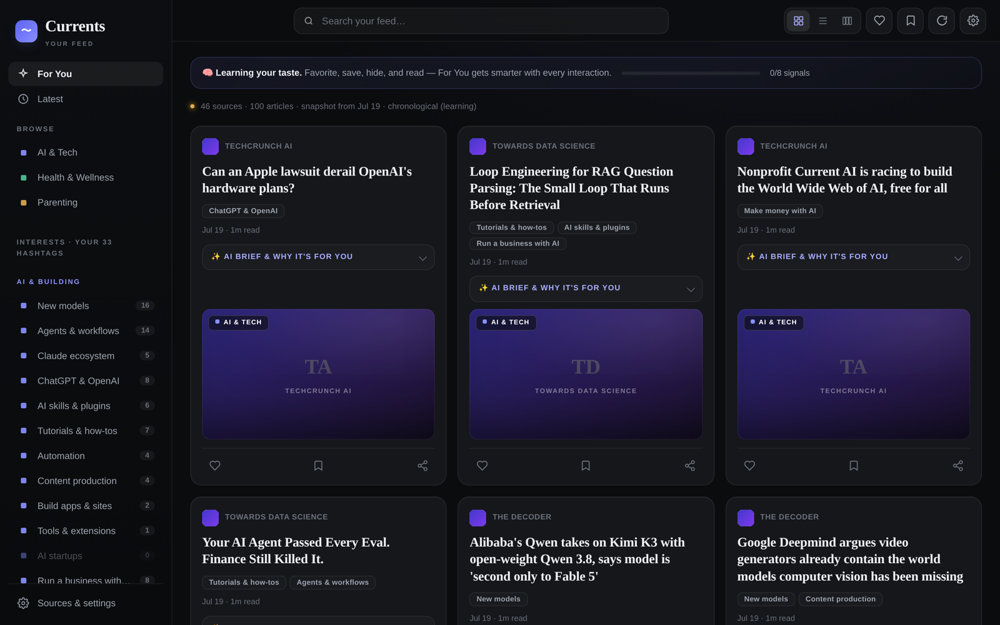
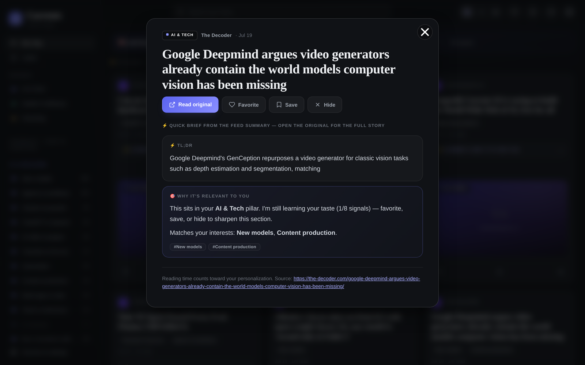
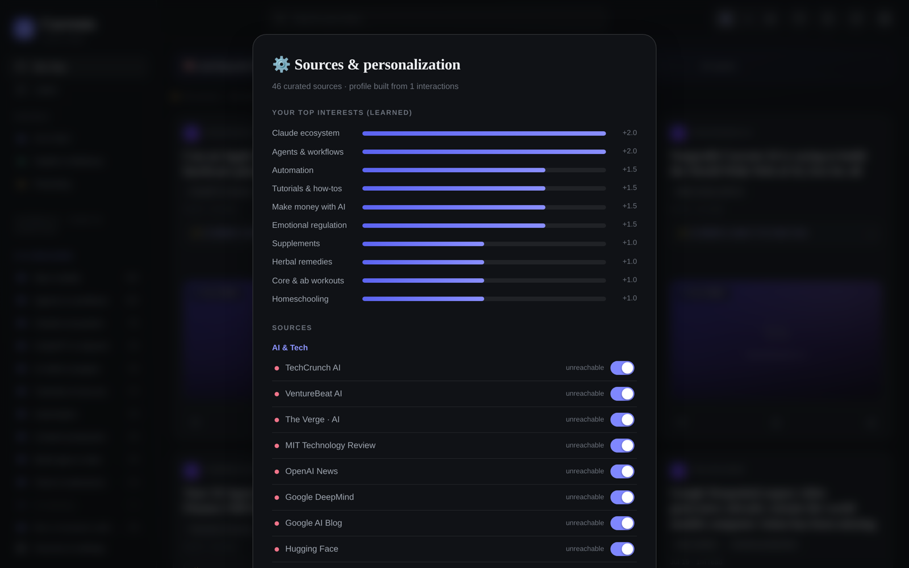
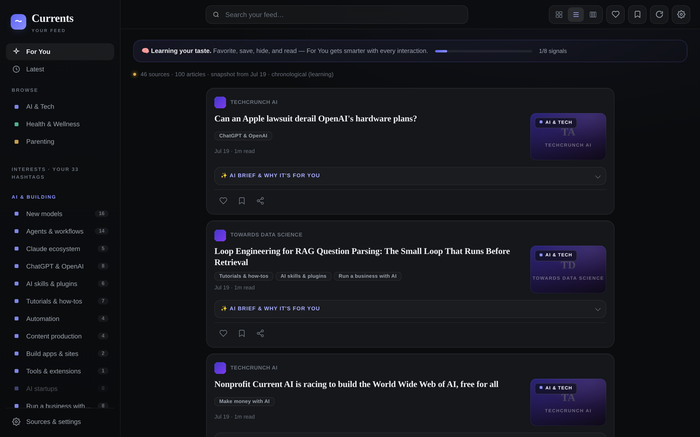
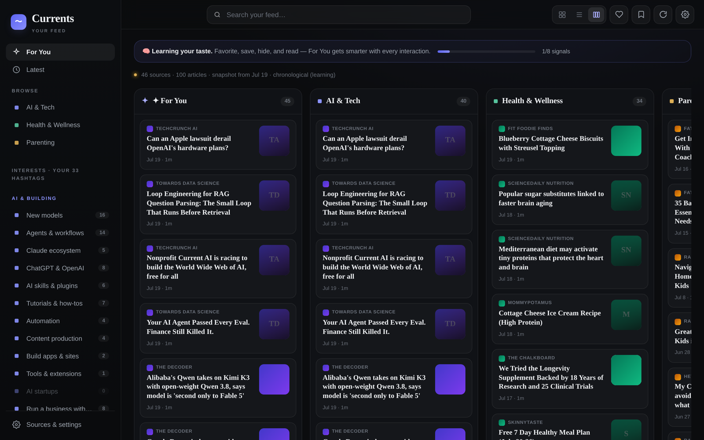
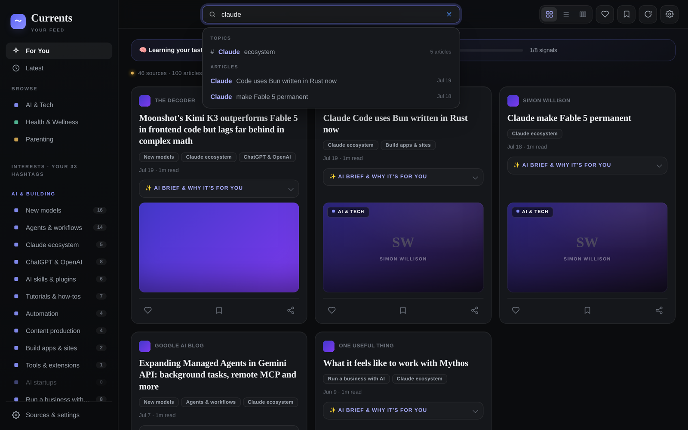
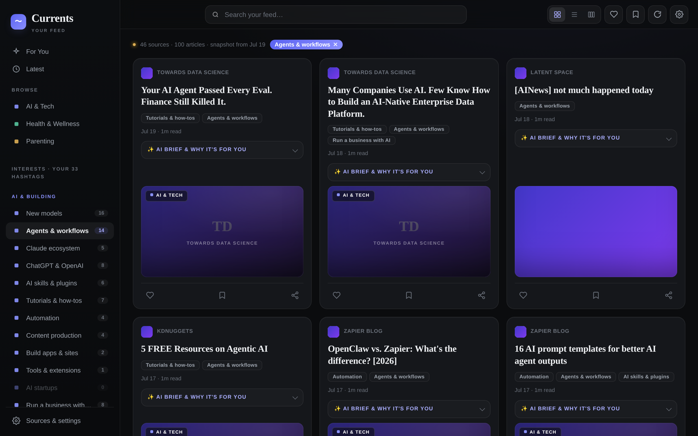
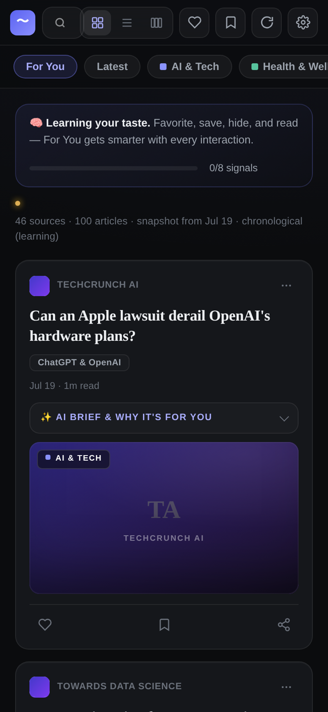
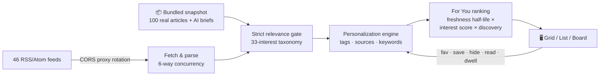

<div align="center">

# 〜 Currents

### A personalized, self-learning news feed — one HTML file, zero backend.

Currents pulls from **46 hand-curated sources**, filters every article through a **33-interest taxonomy**, and quietly **learns your taste** from every favorite, save, hide, and read — all on your device, with no accounts, no server, and no build step.


<br>



</div>

<br>

## ✨ See it in motion

Scroll the feed, pop open an AI brief, read an article, and flip between grid → list → board views:

<div align="center">

</div>

<br>

## What is Currents?

Currents is a single-page RSS reader that behaves like a modern algorithmic feed — think *daily.dev meets Blinkist* — but runs entirely in your browser:

- 📡 **46 curated sources** across three pillars: **AI & Tech**, **Health & Wellness**, and **Parenting**
- 🏷️ **A strict 33-interest taxonomy** — every article must match at least one interest or it's dropped. No filler, no off-topic noise
- 🧠 **An on-device personalization engine** — favorites, saves, hides, opens, and even *reading time* reshape your For You ranking
- ⚡ **AI briefs** on every bundled article — a TL;DR, key ideas, and one actionable takeaway, Blinkist-style
- 🔒 **Total privacy** — your profile lives in `localStorage`. Nothing is tracked, sent, or synced anywhere

And because 100 real articles ship bundled inside the app, **the feed is never empty** — it works offline, from a `file://` URL, or anywhere live fetching is blocked.

<br>

## 📖 The reader & AI briefs

Click any story and Currents opens a distraction-free reader with a **⚡ TL;DR**, **why it's relevant to you**, and matched interest tags. Time spent reading feeds back into your profile.

<div align="center">

</div>

<br>

## 🧠 It learns your taste

For the first 8 interactions the feed stays chronological while Currents watches for signals. After that, **For You** switches to a personalized ranking that blends interest weights, source affinity, title keywords, and freshness (42-hour half-life) — plus a dash of TikTok-style discovery injection so you never get stuck in a bubble.

| Signal | Weight | | Signal | Weight |
|---|---|---|---|---|
| ❤️ Favorite | **+4** | | 💔 Unfavorite | −4 |
| 🔖 Save to collection | **+3** | | 🗑️ Unsave | −3 |
| 🔗 Open original | **+2** | | 🙈 Hide | **−5** |
| 📖 Open in reader | +1.5 | | ⏱️ Dwell time | +0.8 |

Your learned profile is fully transparent — open **Sources & settings** to see exactly which interests Currents thinks you care about, with live weights:

<div align="center">

</div>

<br>

## 🗂️ Three views, one feed

<table>
<tr>
<td align="center" width="33%"><b>Grid</b><br><sub>Visual cards with inline AI briefs</sub></td>
<td align="center" width="33%"><b>List</b><br><sub>Compact, scannable, reader-first</sub></td>
<td align="center" width="33%"><b>Board</b><br><sub>Kanban-style columns per pillar</sub></td>
</tr>
<tr>
<td></td>
<td></td>
<td></td>
</tr>
</table>

<br>

## 🔍 Search & the 33 hashtags

Live autosuggest surfaces matching **topics** and **articles** as you type. Every interest doubles as a hashtag — click one in the sidebar (or on any card) to filter the whole feed to just that thread.

<div align="center">

<br><br>

</div>

<details>
<summary><b>The full taxonomy — 33 interests across 3 pillars</b></summary>
<br>

| 🤖 AI & Building | 🌿 Health & Wellness | 👨‍👩‍👧 Parenting |
|---|---|---|
| New models | Supplements | Kids in the AI era |
| Agents & workflows | Nootropics | Emotional regulation |
| Claude ecosystem | Wellness startups | Therapy-informed parenting |
| ChatGPT & OpenAI | Health tech | Alternative schools |
| AI skills & plugins | AI for health | Homeschooling |
| Tutorials & how-tos | Functional & holistic | Teaching without shame |
| Automation | Traditional Chinese medicine | Mentally strong kids |
| Content production | Herbal remedies | Kids & money |
| Build apps & sites | Food & herb benefits | |
| Tools & extensions | Core & ab workouts | |
| AI startups | Health hacks | |
| Run a business with AI | High-protein meal prep | |
| Make money with AI | | |

An article that matches **none** of these is dropped. Category gates prevent cross-bleed — "tools" in a health article never counts as AI tooling.

</details>

<br>

## 📱 Made for your phone too

Fully responsive with chip tabs, touch-friendly actions, and **pull-to-refresh**:

<div align="center">
<table>
<tr>
<td></td>
<td></td>
</tr>
</table>
</div>

<br>

## ⚙️ How it works



- **Stale-while-revalidate** — the feed renders instantly from cache while fresh articles stream in behind the scenes; a "new stories" pill appears instead of yanking the page out from under you
- **Proxy rotation** — live fetching works from any static host by rotating across multiple CORS proxies, with automatic failover
- **Graceful degradation** — if every proxy is blocked (sandboxed viewers, offline), the bundled snapshot keeps the app fully functional
- **Guarded storage** — `localStorage` when available, transparent in-memory fallback when not

<br>

## 🚀 Getting started

No install. No build. No config.

```bash
git clone https://github.com/christireid/Currents-feed.git
cd Currents-feed

# open it directly…
open index.html

# …or serve it (enables live feed fetching in more browsers)
npx http-server
```

Then make it yours:

1. **React to stories** — favorite ❤️, save 🔖, or hide 🙈 anything. Eight interactions in, **For You** becomes truly yours
2. **Filter by interest** — click any hashtag in the sidebar or on a card
3. **Tune your sources** — toggle any of the 46 feeds in **Sources & settings**
4. **Build collections** — save articles into named collections: recipes, workouts, AI tools…

<br>

## 🗺️ Project structure

```
Currents-feed/
├── index.html   # App shell + the entire editorial dark design system (pure CSS)
├── p1.js        # Sources, 33-interest taxonomy, storage, RSS fetch/parse, personalization engine
├── p2.js        # AI briefs — TL;DR, key ideas & action per bundled article
├── p3.js        # Bundled snapshot: 100 real articles (offline fallback)
└── p4.js        # UI: rendering, reader, search, settings, collections, pull-to-refresh
```

**Design system**: Newsreader (serif display) + Public Sans (UI) on layered near-black surfaces with hairline borders, a restrained indigo accent, WCAG-checked contrast, and `prefers-reduced-motion` support throughout.

<br>

<div align="center">
<sub>Built with vanilla HTML, CSS, and JavaScript — nothing else. Your feed, your data, your device.</sub>
</div>
